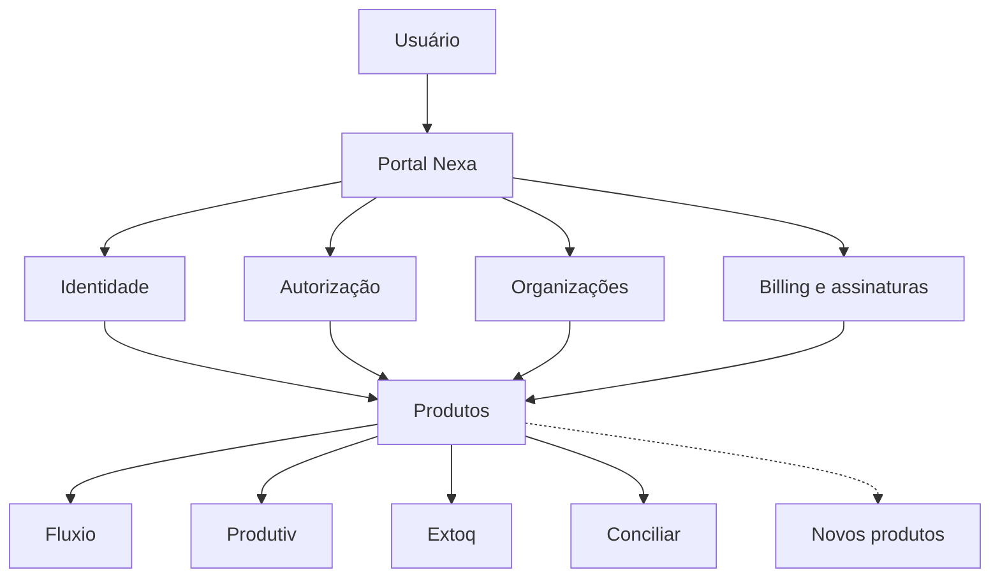
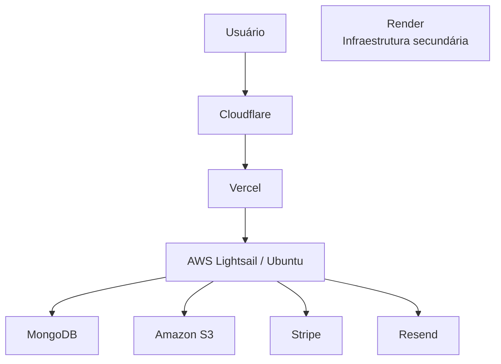

# SWNexa

> **Plataforma modular de soluções empresariais, construída para atender necessidades específicas sem exigir que uma empresa adote um sistema monolítico para tudo.**

[](https://www.swnexa.com)


🌐 **[swnexa.com](https://www.swnexa.com)**

A **SWNexa** é meu principal projeto independente de desenvolvimento de software.

Eu projeto, desenvolvo e opero a plataforma de ponta a ponta: desde conversas com usuários e definição de requisitos até arquitetura, frontend, backend, banco de dados, autenticação, infraestrutura, deploy e operação em produção.

O projeto começou durante minha transição profissional de **Infraestrutura de TI para Desenvolvimento de Software** e evoluiu de uma necessidade real para uma plataforma comercial utilizada em ambiente empresarial.

Hoje, a SWNexa é composta por um **Portal central** e produtos independentes que compartilham identidade, controle de acesso e billing, mas mantêm seus próprios domínios, aplicações, dados e ciclos de deploy.

A arquitetura foi pensada para permitir que novos produtos sejam incorporados ao ecossistema conforme novas necessidades surgirem, sem transformar a plataforma em uma aplicação única e fortemente acoplada.

---

## Visão geral

|                             |                                                          |
| --------------------------- | -------------------------------------------------------- |
| **4 produtos atualmente**   | Fluxio, Produtiv, Extoq e Conciliar                      |
| **1 Portal central**        | Identidade, acesso, usuários, organizações e assinaturas |
| **Arquitetura extensível**  | Novos produtos podem ser integrados ao ecossistema       |
| **Frontends independentes** | Cada produto possui sua própria aplicação                |
| **Backends independentes**  | Cada produto possui sua própria API                      |
| **Bancos independentes**    | Separação dos dados por domínio                          |
| **Deploy independente**     | Cada produto pode evoluir e ser publicado separadamente  |
| **SSO centralizado**        | Uma única identidade para acesso aos produtos            |
| **Billing integrado**       | Trial, assinaturas individuais e plano completo          |
| **Cloud**                   | Vercel, AWS Lightsail, Render, MongoDB, S3 e Cloudflare  |
| **Uso real**                | Plataforma comercial operando em ambiente empresarial    |

---

# Por que construí a SWNexa?

Minha experiência profissional começou em **Infraestrutura de TI**, trabalhando próximo da operação real de empresas.

Nesse contexto, comecei a perceber uma situação recorrente: mesmo organizações que possuem sistemas de gestão robustos continuam utilizando diversas planilhas e ferramentas paralelas para resolver necessidades específicas do dia a dia.

Ao mesmo tempo, empresas menores nem sempre precisam de um sistema grande que tente atender todos os processos possíveis.

Muitas vezes a necessidade é muito mais específica:

* controlar estoque;
* acompanhar produção e produtividade;
* organizar processos;
* gerenciar agendas;
* realizar conciliações;
* resolver alguma demanda operacional particular.

A ideia da SWNexa nasceu justamente desse espaço.

> **Entre planilhas improvisadas e sistemas maiores do que a necessidade real do negócio.**

A proposta não é construir um ERP completo.

A ideia é permitir que cada empresa utilize apenas as soluções que façam sentido para sua operação, mantendo essas soluções integradas dentro de uma mesma plataforma.

---

# Do primeiro problema à plataforma

A primeira oportunidade real surgiu quando uma pequena empresa buscava substituir uma plataforma externa utilizada para gerenciamento de processos.

O objetivo era desenvolver uma solução mais adequada à operação daquela empresa e, ao mesmo tempo, reduzir o custo recorrente da ferramenta utilizada anteriormente.

Foi assim que nasceu o **Fluxio**, primeiro produto da SWNexa.

O sistema foi colocado em produção, começou a ser utilizado em ambiente empresarial e se tornou o primeiro produto comercial do projeto.

A receita da primeira assinatura ajudou a financiar a continuidade do desenvolvimento.

Nesse momento surgiu uma decisão arquitetural importante.

Se novas necessidades fossem transformadas em novos softwares, não faria sentido reconstruir em cada aplicação:

* autenticação;
* usuários;
* organizações;
* permissões;
* controle de acesso;
* assinaturas;
* cobrança.

Foi dessa necessidade que surgiu o **Portal Nexa**.

Em vez de criar vários sistemas completamente isolados, passei a estruturar uma plataforma na qual responsabilidades comuns ficam centralizadas e cada produto continua independente em seu próprio domínio.

---

# Meu papel no projeto

A SWNexa é atualmente projetada, desenvolvida e operada por **um único desenvolvedor**.

Sou responsável por todo o ciclo técnico e boa parte do ciclo de produto:

* contato com usuários;
* levantamento de necessidades;
* análise de processos;
* definição de funcionalidades;
* decisões arquiteturais;
* modelagem de dados;
* desenvolvimento frontend;
* desenvolvimento backend;
* APIs;
* autenticação e autorização;
* integrações externas;
* billing;
* infraestrutura;
* deploy;
* segurança;
* troubleshooting;
* manutenção;
* suporte técnico;
* evolução baseada em feedback de uso real.

Isso me colocou em uma posição em que decisões normalmente distribuídas entre várias áreas precisam ser consideradas em conjunto:

```text
Problema de negócio
        │
        ▼
     Produto
        │
   ┌────┼──────────────┐
   │    │              │
Frontend Backend      Dados
   │    │              │
   └────┼──────────────┘
        │
   Segurança
        │
 Infraestrutura
        │
    Operação
```

Não basta implementar uma funcionalidade.

Também preciso considerar:

* como ela será utilizada;
* como os dados serão representados;
* como a API será exposta;
* quem pode executar cada operação;
* como o produto se integra ao Portal;
* como a aplicação será publicada;
* como identificar problemas em produção;
* como atualizar um produto sem afetar os demais;
* como manter toda a plataforma operacional.

Essa visão ponta a ponta se tornou uma das partes mais importantes da experiência adquirida com o projeto.

---

# Arquitetura da plataforma

A SWNexa segue uma arquitetura modular baseada em duas ideias principais:

1. **capacidades compartilhadas ficam centralizadas no Portal;**
2. **regras de negócio permanecem dentro de produtos independentes.**



O **Portal Nexa** atua como núcleo das capacidades compartilhadas.

Entre suas responsabilidades estão:

* cadastro;
* autenticação;
* usuários;
* organizações;
* permissões;
* trial;
* assinaturas;
* catálogo de produtos;
* billing;
* autorização de acesso;
* integração entre identidade e produtos.

Cada produto continua responsável pelas regras específicas do seu domínio.

---

## Produtos independentes

Uma das principais decisões arquiteturais foi evitar que a SWNexa se tornasse uma única aplicação contendo todas as regras de todos os produtos.

Cada produto possui sua própria estrutura:

```text
Produto
├── Frontend
├── Backend
├── Banco de dados
└── Deploy
```

Os quatro produtos atuais estão no mesmo nível arquitetural e não dependem diretamente uns dos outros:

```text
                           Portal Nexa
                                │
                 Identidade / Acesso / Billing
                                │
        ┌──────────┬────────────┼────────────┬──────────┐
        │          │            │            │          │
     Fluxio     Produtiv      Extoq      Conciliar   ...
        │          │            │            │
    Frontend    Frontend     Frontend     Frontend
    Backend     Backend      Backend      Backend
    Database    Database     Database     Database
    Deploy      Deploy       Deploy       Deploy
```

Uma alteração no Extoq, por exemplo, não exige que Fluxio, Produtiv ou Conciliar sejam publicados novamente.

Cada produto pode:

* evoluir em ritmo próprio;
* possuir regras específicas;
* receber deploy independentemente;
* organizar seu próprio domínio de dados;
* ser mantido sem dependência direta dos demais produtos.

---

## Crescimento da plataforma

Os quatro produtos existentes hoje **não representam um limite da arquitetura**.

O Portal foi desenvolvido como uma camada central de capacidades compartilhadas.

Isso permite que um novo produto seja incorporado ao ecossistema utilizando elementos já existentes, como:

```text
Novo produto
     │
     ├── identidade
     ├── organização
     ├── autorização
     ├── entitlement
     └── billing
          │
          ▼
      Portal Nexa
```

Ao mesmo tempo, esse novo produto pode manter:

* frontend próprio;
* backend próprio;
* banco próprio;
* regras de domínio próprias;
* deploy próprio.

Conceitualmente:

```text
                         SWNexa Platform
                               │
                         Portal Nexa
                               │
              ┌────────────────┴────────────────┐
              │                                 │
     Capacidades compartilhadas         Produtos independentes
              │                                 │
       ├── Identidade                  ├── Fluxio
       ├── Autorização                 ├── Produtiv
       ├── Organizações                ├── Extoq
       ├── Billing                     ├── Conciliar
       └── Assinaturas                 └── novos produtos...
```

A intenção é que adicionar um novo domínio de negócio não exija modificar diretamente os produtos existentes.

Essa separação permite que a SWNexa cresça horizontalmente, adicionando novas soluções ao ecossistema sem concentrar todas as regras de negócio em uma única base de código.

### Trade-off

Essa independência tem custo.

Mais produtos significam:

* mais aplicações;
* mais APIs;
* mais configurações;
* mais processos de deploy;
* mais infraestrutura para manter;
* maior necessidade de padronização.

Optei por aceitar essa complexidade operacional em troca de menor acoplamento e maior liberdade para que cada produto evolua de maneira independente.

---

# Identidade, SSO e controle de acesso

O usuário possui **uma única identidade na SWNexa**.

Não é necessário criar uma conta separada em cada produto.

```text
Usuário
   │
   ▼
Portal Nexa
   │
   ├── autenticação
   ├── organização
   ├── assinatura
   ├── permissões
   └── produtos autorizados
           │
           ▼
        Produto
```

Depois de autenticado no Portal, o usuário consegue acessar os produtos aos quais possui direito sem realizar um novo login manual.

O Portal funciona como autoridade central para determinar se aquela conta está autorizada a utilizar o produto solicitado.

Caso alguém tente acessar diretamente um produto sem possuir uma sessão ou autorização válida, o fluxo retorna para o Portal.

Os produtos permanecem independentes, mas a experiência de identidade é única para o usuário.

A comunicação de autenticação entre Portal e produtos utiliza um fluxo controlado de **SSO**.

Detalhes sensíveis de implementação não fazem parte desta documentação pública.

---

# Trial, assinatura e entitlement

O direito de acesso aos produtos também faz parte da arquitetura de autorização.

Uma nova conta recebe atualmente **14 dias corridos de acesso a todos os produtos da plataforma**.

```text
Cadastro
   │
   ▼
14 dias de trial
   │
   ▼
Todos os produtos disponíveis
   │
   ▼
Fim do trial
   │
   ├── Sem assinatura
   │       │
   │       ▼
   │   Acesso bloqueado
   │
   └── Assinatura ativa
           │
           ▼
      Produtos do plano
```

Após esse período, a conta precisa possuir uma assinatura compatível.

Atualmente existem duas formas principais de acesso:

* assinatura de produtos individuais;
* plano com acesso ao conjunto da plataforma.

O gerenciamento financeiro é integrado ao **Stripe**.

O usuário pode gerenciar sua assinatura diretamente pelo Portal, incluindo ações relacionadas ao plano, cancelamento e renovação.

Isso conecta billing diretamente ao modelo de autorização.

A plataforma não precisa apenas saber:

> Quem é este usuário?

Ela também precisa responder:

> A qual organização ele pertence?

> Quais permissões possui?

> Quais produtos essa conta pode utilizar neste momento?

Esse conceito de **entitlement** é uma das responsabilidades centrais do Portal.

---

# Produtos atuais

Hoje, quatro produtos estão integrados à plataforma:

| Produto       | Domínio                                 |
| ------------- | --------------------------------------- |
| **Fluxio**    | Fluxos e processos empresariais         |
| **Produtiv**  | Produção, produtividade, vendas e metas |
| **Extoq**     | Estoque e inventário                    |
| **Conciliar** | Conciliação financeira e bancária       |

O README principal não pretende documentar em profundidade as regras e funcionalidades de cada produto.

Cada solução possui contexto, decisões técnicas e evolução próprios, que serão documentados separadamente.

A estrutura prevista para essa documentação é:

```text
docs/
└── products/
    ├── portal-nexa.md
    ├── fluxio.md
    ├── produtiv.md
    ├── extoq.md
    └── conciliar.md
```

Esses documentos poderão reunir informações como:

* problema que originou o produto;
* principais funcionalidades;
* arquitetura específica;
* decisões técnicas;
* desafios encontrados;
* screenshots;
* resultados observados em uso real.

O README principal permanece focado na **plataforma SWNexa como sistema e projeto de engenharia**.

---

# Case real: Produtiv

Um dos resultados mais claros observados até agora está relacionado ao **Produtiv**.

Antes da implantação, um processo operacional de preenchimento e consolidação de informações exigia aproximadamente:

| Antes                                                                      | Com o Produtiv                                                       |
| -------------------------------------------------------------------------- | -------------------------------------------------------------------- |
| Um dia inteiro de trabalho para processar aproximadamente um dia da agenda | Uma semana da agenda pode ser processada em aproximadamente 1–2 dias |

O ganho veio principalmente da redução de tarefas manuais e da possibilidade de inserir e organizar informações em lote.

Além da velocidade de lançamento, os dados passam a ficar estruturados para acompanhamento posterior de produção e vendas.

*Resultado observado nesse processo específico durante o uso real da plataforma.*

---

# Impacto além do código

Outro efeito observado em uso real foi a redução da dependência de múltiplas ferramentas externas.

Parte das necessidades que anteriormente exigiam plataformas e assinaturas diferentes passou a ser atendida dentro da SWNexa.

Isso ajudou a reduzir custos recorrentes e simplificar a experiência dos usuários ao centralizar diferentes necessidades em uma única identidade.

Para mim, esse tipo de resultado é especialmente importante porque diferencia a SWNexa de um projeto construído apenas como exercício técnico.

O software precisa resolver um problema suficientemente bem para que alguém realmente escolha utilizá-lo no trabalho.

---

# Infraestrutura

A infraestrutura combina serviços gerenciados com componentes administrados diretamente.



## Frontend

Os frontends são publicados pela **Vercel**.

Cada produto possui aplicação e deploy próprios.

## Backend

Os backends principais são executados em **AWS Lightsail**, utilizando **Ubuntu**.

A operação envolve componentes e conhecimentos como:

* Linux;
* Nginx;
* gerenciamento de processos;
* variáveis de ambiente;
* reverse proxy;
* deploy;
* health checks;
* troubleshooting.

Existe também infraestrutura secundária no **Render**, mantida como alternativa operacional para os backends.

Ela não é tratada nesta documentação como failover automático.

## Dados

A plataforma utiliza **MongoDB**.

Portal e produtos possuem separação lógica de dados de acordo com seus respectivos domínios.

## Arquivos

O **Amazon S3** é utilizado para armazenamento de arquivos.

## E-mail

O **Resend** é utilizado para e-mails transacionais.

## Pagamentos

O **Stripe** é utilizado para pagamentos e gerenciamento de assinaturas.

## Domínio e edge

O **Cloudflare** participa da camada pública de domínio e tráfego da plataforma.

---

# Stack

| Área                      | Tecnologias                    |
| ------------------------- | ------------------------------ |
| Frontend                  | React, TypeScript              |
| Backend                   | Node.js, TypeScript, APIs REST |
| Banco de dados            | MongoDB                        |
| Frontend hosting          | Vercel                         |
| Backend infrastructure    | AWS Lightsail, Ubuntu          |
| Infraestrutura secundária | Render                         |
| Reverse proxy             | Nginx                          |
| Object storage            | Amazon S3                      |
| E-mail transacional       | Resend                         |
| Pagamentos                | Stripe                         |
| DNS / Edge                | Cloudflare                     |
| Versionamento             | GitHub                         |

---

# Segurança e backend

À medida que a plataforma passou a operar em produção, segurança, previsibilidade das APIs e observabilidade deixaram de ser apenas preocupações futuras e passaram a fazer parte da evolução da arquitetura.

Entre os pontos trabalhados estão:

* cookies `HttpOnly`;
* proteção CSRF;
* políticas de CORS;
* autenticação centralizada;
* autorização por usuário, organização e produto;
* RBAC onde aplicável;
* validação de entrada;
* tratamento centralizado de erros;
* respostas HTTP consistentes;
* request IDs;
* logging estruturado;
* sanitização de informações sensíveis;
* separação entre erros internos e respostas públicas.

O objetivo não é apenas impedir acesso indevido.

Também é tornar os diferentes backends mais previsíveis para desenvolver, operar e investigar.

Detalhes que poderiam revelar informações operacionais sensíveis não fazem parte deste repositório.

---

# Evolução da arquitetura

A arquitetura atual não foi definida completamente antes da primeira versão.

Ela evoluiu conforme o projeto passou por problemas reais de desenvolvimento e produção.

Essa evolução é uma das partes que considero mais relevantes da experiência adquirida com a SWNexa.

---

## Autenticação

As primeiras versões utilizavam uma abordagem mais simples.

Com o surgimento de vários produtos, ficou claro que identidade e autorização não deveriam ser implementadas isoladamente em cada aplicação.

A arquitetura passou a evoluir em direção a:

* Portal como autoridade central;
* sessões mais seguras;
* SSO;
* autorização centralizada;
* separação entre autenticação e entitlement;
* sessões próprias dos produtos quando necessário.

Essa mudança surgiu da evolução real da plataforma, e não apenas de uma decisão teórica de arquitetura.

---

## Infraestrutura

A infraestrutura também mudou ao longo do projeto.

Localização dos serviços, latência entre aplicações e banco de dados, gerenciamento de processos e estratégia de publicação dos backends precisaram ser revistos conforme a SWNexa passou a operar continuamente.

Minha experiência anterior com infraestrutura foi especialmente útil nessa etapa.

Conceitos com os quais eu já trabalhava passaram a fazer parte direta da engenharia das aplicações:

* Linux;
* DNS;
* HTTP;
* TLS;
* reverse proxy;
* processos;
* rede;
* cloud;
* disponibilidade;
* troubleshooting.

---

## Padronização dos backends

Quando existem vários produtos independentes, surge outro problema:

> Como impedir que cada backend evolua para padrões completamente diferentes?

Por isso, uma das frentes atuais de engenharia é aumentar a consistência entre as APIs.

Isso envolve padronização de:

* validação;
* tratamento de erros;
* autenticação;
* autorização;
* respostas HTTP;
* logging;
* request IDs;
* health checks;
* configuração;
* estrutura geral das aplicações.

A intenção não é fazer todos os produtos compartilharem a mesma regra de negócio.

É criar uma base técnica mais previsível para desenvolver e manter múltiplas aplicações.

---

# Decisões e trade-offs

## Portal central

**Decisão:** concentrar identidade, acesso, organizações, entitlement e billing.

**Benefício:** evita duplicação dessas responsabilidades entre os produtos e cria uma experiência única para o usuário.

**Custo:** o Portal se torna um componente crítico e precisa manter contratos confiáveis com diferentes aplicações.

---

## Backend por produto

**Decisão:** cada produto possui API própria.

**Benefício:** independência de domínio, desenvolvimento e deploy.

**Custo:** aumenta o número de aplicações que precisam ser configuradas, atualizadas e observadas.

---

## Banco separado por domínio

**Decisão:** produtos mantêm seus dados separados.

**Benefício:** reduz acoplamento e torna mais clara a responsabilidade de cada domínio.

**Custo:** operações que precisem atravessar diferentes produtos exigem maior cuidado arquitetural.

---

## Arquitetura extensível

**Decisão:** novos produtos se integram às capacidades centrais em vez de serem incorporados diretamente aos produtos existentes.

**Benefício:** a plataforma pode crescer adicionando novos domínios sem aumentar diretamente o acoplamento entre os sistemas atuais.

**Custo:** contratos de autenticação, autorização e integração precisam permanecer consistentes ao longo da evolução da plataforma.

---

## Infraestrutura com controle operacional

**Decisão:** utilizar serviços gerenciados onde fazem sentido, mantendo controle direto sobre parte da infraestrutura dos backends.

**Benefício:** maior flexibilidade operacional e capacidade de diagnosticar problemas.

**Custo:** servidores, processos, configurações e deploy também passam a fazer parte das responsabilidades de manutenção.

---

# Desenvolvimento orientado pelo uso real

As funcionalidades da SWNexa não são definidas apenas a partir das minhas próprias ideias.

Existe contato com usuários para entender:

* necessidades;
* dificuldades;
* processos atuais;
* sugestões;
* bugs;
* oportunidades de melhoria.

O suporte também gera informações que retornam para o desenvolvimento.

O ciclo acaba funcionando aproximadamente assim:

```text
Problema real
     │
     ▼
Conversa com usuário
     │
     ▼
Entendimento do processo
     │
     ▼
Definição da solução
     │
     ▼
Decisão técnica
     │
     ▼
Implementação
     │
     ▼
Deploy
     │
     ▼
Uso real
     │
     ▼
Feedback
     │
     └──────────────► Nova evolução
```

Essa é uma das diferenças mais importantes entre a SWNexa e projetos desenvolvidos apenas com finalidade de estudo.

---

# Por que este projeto está no meu portfólio?

Minha carreira profissional começou em **Infraestrutura de TI**, e meu objetivo atual é realizar a transição para **Desenvolvimento de Software**.

A SWNexa foi a maneira que encontrei de não limitar essa transição a cursos, exercícios e projetos fictícios.

Construindo e operando a plataforma, tive contato prático com problemas relacionados a:

* frontend;
* backend;
* APIs;
* arquitetura;
* modelagem de dados;
* autenticação;
* autorização;
* segurança;
* billing;
* integrações;
* cloud;
* infraestrutura;
* deploy;
* produção;
* suporte;
* manutenção de software.

Ao mesmo tempo, desenvolver um projeto praticamente sozinho também deixa claro o que uma experiência individual não consegue reproduzir completamente.

Meu objetivo profissional é atuar como desenvolvedor dentro de uma equipe de engenharia, participando de experiências como:

* code review;
* decisões arquiteturais compartilhadas;
* desenvolvimento colaborativo;
* manutenção de código em equipe;
* padrões definidos coletivamente;
* troca técnica com outros desenvolvedores;
* processos profissionais de engenharia de software.

A SWNexa é um projeto independente que desenvolvo e mantenho paralelamente às minhas atividades profissionais.

Ela não representa uma alternativa à construção de uma carreira dentro de uma equipe de desenvolvimento.

Pelo contrário: desenvolver um produto de ponta a ponta reforçou meu interesse em trabalhar profissionalmente com software ao lado de outros desenvolvedores.

---

# O que quero demonstrar com este repositório

O código de produção da SWNexa permanece privado.

Por isso, este repositório não existe para apresentar milhares de linhas de código abertas.

Ele existe para documentar algo que considero mais representativo deste projeto:

> **as decisões necessárias para transformar problemas reais em software funcionando em produção.**

Aqui pretendo documentar progressivamente:

* arquitetura;
* decisões de engenharia;
* trade-offs;
* infraestrutura;
* autenticação;
* segurança;
* evolução técnica;
* resultados observados;
* problemas encontrados;
* mudanças feitas a partir desses problemas.

---

# Documentação técnica

A documentação detalhada fica separada do README principal.

* [Arquitetura](docs/architecture.md)
* [Autenticação e acesso](docs/authentication.md)
* [Infraestrutura](docs/infrastructure.md)
* [Segurança](docs/security.md)
* [Decisões de engenharia](docs/engineering-decisions.md)
* [Roadmap técnico](docs/roadmap.md)
* [Diagramas](diagrams/README.md)
* [Screenshots](screenshots/README.md)

A documentação específica dos produtos será organizada em:

```text
docs/products/
├── portal-nexa.md
├── fluxio.md
├── produtiv.md
├── extoq.md
└── conciliar.md
```

---

# Próximas evoluções deste repositório

* [ ] documentação individual dos produtos;
* [ ] screenshots sanitizados das principais interfaces;
* [ ] diagrama visual completo da arquitetura;
* [ ] documentação mais detalhada do fluxo de SSO;
* [ ] histórico de decisões arquiteturais;
* [ ] evolução da infraestrutura;
* [ ] estratégia de padronização dos backends;
* [ ] observabilidade;
* [ ] CI e validações de deploy;
* [ ] novos cases de uso real;
* [ ] documentação da integração de novos produtos à plataforma.

---

# Código-fonte

**A SWNexa é um software proprietário e closed source.**

Os repositórios utilizados em produção permanecem privados.

Este repositório contém documentação pública, decisões de engenharia, diagramas e materiais preparados especificamente para apresentação profissional.

Credenciais, configurações operacionais sensíveis, dados de clientes e detalhes privados de implementação não fazem parte deste projeto.

---

## Licença

Copyright © SWNexa / Nexa Systems. All rights reserved.

Consulte [LICENSE](LICENSE).
