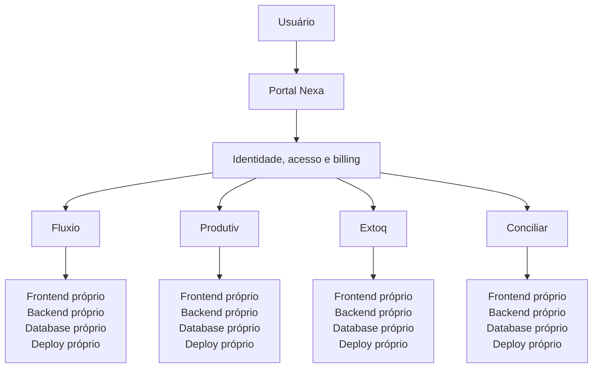

# SWNexa

> Soluções empresariais modulares para o espaço entre planilhas improvisadas e sistemas maiores do que a necessidade real do negócio.

[](https://swnexa.com)


**SWNexa** é uma plataforma de soluções empresariais composta por um portal central e produtos especializados. Ela permite que cada empresa adote apenas as ferramentas de que realmente precisa, mantendo uma experiência integrada de identidade, acesso e assinatura.

🌐 [swnexa.com](https://swnexa.com)

## O problema

Mesmo empresas que já utilizam sistemas de gestão robustos costumam depender de planilhas e ferramentas paralelas para atividades específicas do dia a dia. Em contrapartida, pequenas empresas nem sempre precisam — ou conseguem justificar — a adoção de um ERP completo.

Necessidades como estoque, produtividade, fluxos de processos, agendamento e conciliação podem exigir soluções mais focadas. A SWNexa nasceu para atender esse espaço: menos improviso operacional e menos complexidade desnecessária.

## Da necessidade real ao primeiro produto

O primeiro produto do ecossistema foi o **Fluxio**. Ele surgiu a partir de uma necessidade concreta de uma pequena empresa que usava uma plataforma externa para gerenciamento de processos e buscava uma alternativa mais aderente ao seu contexto e com menor custo.

O desenvolvimento levou à implantação em ambiente real e à primeira assinatura comercial. Essa receita ajudou a financiar a evolução da SWNexa e a construção dos demais produtos do ecossistema.

Não se trata de um projeto de tutorial ou de uma demonstração fictícia: é uma plataforma comercial em produção, utilizada em ambiente empresarial há mais de dois meses.

## A plataforma hoje

A SWNexa é organizada em torno do **Portal Nexa**, o ponto central para cadastro, identidade, acesso, produtos e assinaturas. Cada produto mantém sua responsabilidade de negócio e sua independência operacional.

```text
SWNexa
│
├── Portal Nexa
│
├── Fluxio
├── Produtiv
├── Extoq
└── Conciliar
```

A plataforma não busca ser um ERP completo. A proposta é permitir que cada empresa componha sua própria combinação de soluções:

```text
Empresa A
├── Fluxio
└── Extoq

Empresa B
└── Produtiv

Empresa C
├── Fluxio
├── Produtiv
└── Conciliar
```

Os produtos podem ser contratados individualmente ou por meio de um plano com acesso ao conjunto da plataforma.

## Impacto em produção

O **Produtiv** é o primeiro case público de resultado operacional observado durante o uso real da plataforma.

| Antes | Com o Produtiv |
| --- | --- |
| Aproximadamente um dia de trabalho para processar um dia da agenda | Aproximadamente uma semana processada em 1–2 dias |

Esse resultado é específico desse processo e representa uma redução relevante de trabalho manual, além de maior velocidade para consolidar e visualizar informações de produção e vendas. Não é um benchmark científico nem uma métrica generalizável para todos os contextos.

Em outro uso real, a adoção da plataforma também permitiu consolidar necessidades antes atendidas por diferentes ferramentas e assinaturas, reduzindo custos com plataformas separadas. Não são divulgados valores, fornecedores ou dados de clientes.

## Produtos

| Produto | Papel público |
| --- | --- |
| **Portal Nexa** | Portal central de cadastro, autenticação, usuários, organizações, permissões, assinaturas, catálogo e autorização de acesso. |
| **Fluxio** | Produto que deu origem comercial ao ecossistema, voltado a fluxos e processos. **TODO:** definir descrição pública detalhada. |
| **Produtiv** | Solução para acompanhamento de produtividade e metas empresariais. |
| **Extoq** | Solução para gerenciamento de estoque, inventário e acompanhamento de itens. |
| **Conciliar** | Solução para conciliação financeira ou bancária e gerenciamento de lançamentos. |

## Como a plataforma funciona

Há uma identidade única para a SWNexa. Uma nova pessoa ou empresa cria sua conta uma vez no Portal Nexa e recebe acesso a todos os produtos durante um período inicial de 14 dias corridos, sem bloqueio de módulos. Após esse período, o acesso fica bloqueado até a escolha de uma assinatura compatível.

As assinaturas podem liberar produtos individuais ou o conjunto da plataforma. O Portal integra-se ao Stripe e permite que o próprio usuário gerencie operações de assinatura, como cancelamento, renovação automática e gerenciamento do plano.

Depois de autenticado no Portal, o usuário acessa automaticamente os produtos para os quais está autorizado. Caso tente entrar diretamente em um produto sem sessão ou autorização válida, é direcionado ao Portal para seguir o fluxo adequado. Esse modelo combina SSO com controle centralizado de acesso, sem expor detalhes internos de implementação.

## Arquitetura

O Portal Nexa centraliza identidade, acesso e billing. Os produtos pertencem ao mesmo ecossistema, mas cada um possui frontend, backend, banco de dados e ciclo de deploy próprios.



Essa separação permite evolução e publicação independentes, preservando a integração de acesso e a coerência da plataforma.

## Destaques de engenharia

- Arquitetura modular com produtos operacionalmente independentes.
- Frontend, backend, banco de dados e deploy próprios por produto.
- Autenticação centralizada, autorização e SSO controlado.
- APIs em Node.js e TypeScript com validação e tratamento padronizado de erros.
- Operação em cloud, deploy e troubleshooting de aplicações reais.
- Cookies HttpOnly, CSRF, CORS e RBAC quando aplicável.
- Logging estruturado e request IDs para visibilidade operacional.
- Integrações com armazenamento, pagamentos e e-mail transacional.

## Stack e infraestrutura

| Área | Tecnologias e serviços |
| --- | --- |
| Frontend | React, TypeScript, Vercel |
| Backend | Node.js, TypeScript, APIs REST, AWS Lightsail, Ubuntu |
| Infraestrutura secundária | Render, como secondary deployment/fallback deployment |
| Dados | MongoDB |
| Arquivos | Amazon S3 |
| E-mail | Resend |
| Pagamentos | Stripe |
| Código | GitHub |
| Domínio e edge | Cloudflare |

Detalhes como IPs, portas, hostnames, connection strings, credenciais e topologia interna não fazem parte desta documentação pública.

## Evolução de engenharia

O projeto evolui a partir de problemas encontrados em uso e operação reais. A autenticação caminhou para uma abordagem centralizada, com sessões mais seguras e fluxo controlado entre o Portal e os produtos. A infraestrutura também foi ajustada em busca de menor latência, separação de responsabilidades, deploy independente e maior controle operacional.

Os backends seguem um processo de padronização de erros estruturados, validação, request IDs, logging e respostas HTTP consistentes. O desenvolvimento é orientado também por conversas com usuários, feedback, identificação de dificuldades, validação de mudanças e aprendizados obtidos pelo suporte.

## Desenvolvimento e operação

A SWNexa foi projetada, desenvolvida e é operada de forma independente por um único desenvolvedor. O trabalho abrange levantamento de requisitos, contato com usuários, definição de funcionalidades, arquitetura, frontend, backend, dados, infraestrutura, segurança, integrações, deploy, manutenção, troubleshooting e evolução contínua do produto.

## Documentação adicional

- [Arquitetura](docs/architecture.md)
- [Autenticação e acesso](docs/authentication.md)
- [Infraestrutura](docs/infrastructure.md)
- [Segurança](docs/security.md)
- [Decisões de engenharia](docs/engineering-decisions.md)
- [Roadmap](docs/roadmap.md)
- [Diagramas](diagrams/README.md)
- [Screenshots](screenshots/README.md)

## Código-fonte e propriedade

A SWNexa é proprietária e closed source. Os repositórios de produção, o código-fonte, as configurações operacionais e detalhes de implementação permanecem privados. Este repositório é uma apresentação pública e um case de engenharia, contendo apenas informações adequadas para divulgação.

## Licença

Copyright © SWNexa / Nexa Systems. All rights reserved. Consulte [LICENSE](LICENSE).
