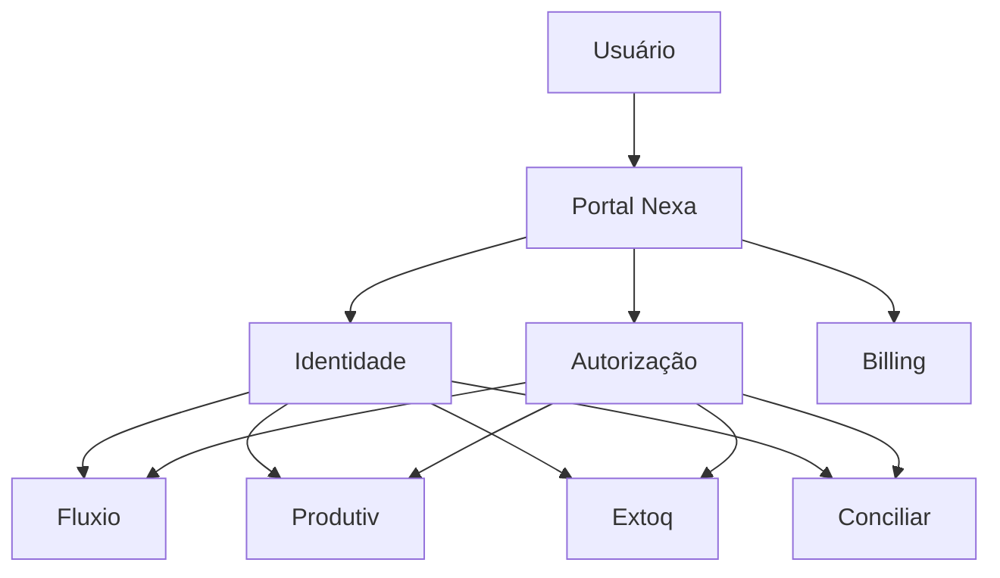
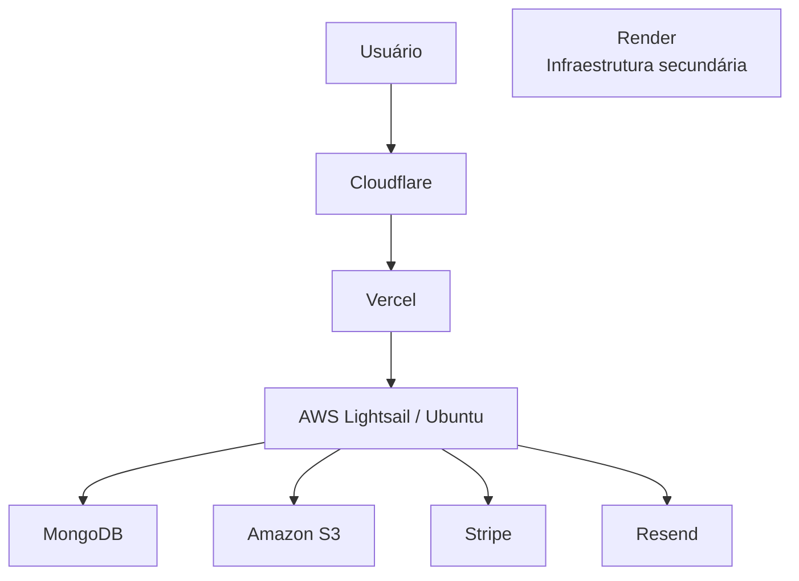

# SWNexa

> **Plataforma modular de soluções empresariais, construída para atender necessidades específicas sem exigir que uma empresa adote um sistema monolítico para tudo.**

[](https://www.swnexa.com)


🌐 **[swnexa.com](https://www.swnexa.com)**

A **SWNexa** é meu principal projeto independente de desenvolvimento de software.

Eu projeto, desenvolvo e opero a plataforma de ponta a ponta: desde conversas com usuários e definição de requisitos até arquitetura, frontend, backend, banco de dados, autenticação, infraestrutura, deploy e operação em produção.

O projeto começou durante minha transição profissional de **Infraestrutura de TI para Desenvolvimento de Software** e evoluiu de uma necessidade real para uma plataforma comercial utilizada em ambiente empresarial.

Hoje, a SWNexa possui um Portal central e produtos independentes que compartilham identidade, controle de acesso e billing, mas mantêm seus próprios ciclos de desenvolvimento e deploy.

---

## Visão geral

|                                 |                                                                |
| ------------------------------- | -------------------------------------------------------------- |
|  **4 produtos**               | Fluxio, Produtiv, Extoq e Conciliar                            |
|  **1 Portal central**         | Identidade, acesso, usuários, organizações e assinaturas       |
|  **Frontends independentes** | Cada produto possui sua própria aplicação                      |
|  **Backends independentes**   | Cada produto possui sua própria API                            |
|  **Bancos independentes**    | Separação de dados por produto dentro do MongoDB               |
|  **Deploy independente**      | Cada aplicação pode evoluir e ser publicada separadamente      |
|  **SSO centralizado**         | O usuário não precisa realizar login novamente em cada produto |
|  **Billing integrado**        | Trial, assinaturas individuais e plano completo                |
|  **Cloud**                    | Vercel, AWS Lightsail, Render, MongoDB, S3 e Cloudflare        |
|  **Uso real**                 | Plataforma comercial operando em ambiente empresarial          |

---

# Por que construí a SWNexa?

Minha experiência profissional começou em **Infraestrutura de TI**, trabalhando próximo da operação real de empresas.

Nesse contexto, comecei a perceber um padrão interessante:

mesmo empresas que possuem sistemas de gestão robustos continuam utilizando diversas planilhas e ferramentas paralelas para resolver necessidades específicas do dia a dia.

Ao mesmo tempo, empresas menores nem sempre precisam de um sistema gigantesco.

Muitas vezes precisam apenas de algo específico:

* controle de estoque;
* acompanhamento de produtividade;
* organização de processos;
* agendamento;
* conciliação;
* alguma outra necessidade operacional particular.

A ideia da SWNexa nasceu justamente desse espaço.

> **Entre planilhas improvisadas e sistemas maiores do que a necessidade real do negócio.**

A proposta não é construir um ERP que tente fazer tudo.

A proposta é permitir que uma empresa utilize apenas as soluções de que realmente precisa.

---

# Do primeiro problema ao primeiro produto

A primeira oportunidade real apareceu quando uma pequena empresa buscava substituir uma plataforma externa utilizada para gerenciamento de processos.

O objetivo era ter uma solução mais adequada à operação daquela empresa e, ao mesmo tempo, reduzir o custo recorrente da ferramenta utilizada anteriormente.

Foi assim que nasceu o **Fluxio**, primeiro produto da SWNexa.

O que inicialmente poderia ter sido apenas um sistema isolado acabou se tornando o ponto de partida para uma arquitetura maior.

O Fluxio foi colocado em produção, passou a ser utilizado em ambiente real e se tornou o primeiro produto comercial da plataforma.

A receita dessa primeira assinatura ajudou a financiar a evolução do projeto e o desenvolvimento dos demais produtos.

A partir daí surgiu uma pergunta importante:

> Se outras necessidades empresariais também seriam transformadas em software, fazia sentido reconstruir autenticação, usuários, permissões, cobrança e gerenciamento de conta em cada sistema?

Minha resposta foi não.

Foi dessa decisão que nasceu o **Portal Nexa** e, posteriormente, a arquitetura atual da SWNexa.

---

# Meu papel no projeto

A SWNexa é atualmente projetada, desenvolvida e operada por **um único desenvolvedor**.

Minha responsabilidade inclui todo o ciclo do produto:

* conversa com usuários;
* levantamento de necessidades;
* transformação de problemas operacionais em funcionalidades;
* definição de arquitetura;
* modelagem de dados;
* desenvolvimento frontend;
* desenvolvimento backend;
* APIs;
* autenticação e autorização;
* integrações externas;
* billing;
* infraestrutura;
* deploy;
* segurança;
* troubleshooting;
* manutenção;
* suporte técnico;
* evolução baseada em feedback de uso real.

Isso me colocou na posição de tomar decisões que normalmente estariam distribuídas entre diferentes áreas de uma equipe:

```text
Produto
   │
   ├── UX / Frontend
   ├── Backend
   ├── Dados
   ├── Segurança
   ├── Infraestrutura
   └── Operação
```

Para mim, essa visão ponta a ponta acabou se tornando uma das partes mais valiosas do projeto.

Não basta fazer uma tela funcionar.

Eu também preciso pensar em:

* como ela será utilizada;
* como os dados serão modelados;
* como a API será exposta;
* quem pode executar determinada operação;
* como aquilo será publicado;
* como será monitorado;
* como investigar um erro;
* como atualizar sem afetar os outros produtos;
* e como manter tudo isso funcionando em produção.

---

# Arquitetura da plataforma

A SWNexa utiliza uma arquitetura modular.

O **Portal Nexa** funciona como núcleo da plataforma e concentra responsabilidades compartilhadas entre os produtos.



O Portal é responsável por elementos como:

* cadastro;
* autenticação;
* usuários;
* organizações;
* permissões;
* assinatura;
* catálogo de produtos;
* controle de acesso.

Os produtos continuam responsáveis exclusivamente pelas regras relacionadas aos seus próprios domínios.

---

## Por que não colocar tudo em uma aplicação?

Uma das decisões arquiteturais mais importantes foi manter os produtos **operacionalmente independentes**.

Cada produto possui:

```text
Produto
├── Frontend próprio
├── Backend próprio
├── Banco próprio
└── Deploy próprio
```

Conceitualmente:

```text
                        Portal Nexa
                             │
              Identidade / Acesso / Billing
                             │
          ┌──────────────────┼──────────────────┐
          │                  │                  │
       Fluxio             Produtiv            Extoq
          │                  │                  │
      Frontend           Frontend           Frontend
      Backend            Backend            Backend
      Database           Database           Database
      Deploy             Deploy             Deploy

                             │
                         Conciliar
                             │
                         Frontend
                         Backend
                         Database
                         Deploy
```

Essa separação permite que uma alteração no Extoq, por exemplo, não exija necessariamente uma nova publicação do Fluxio ou do Produtiv.

Cada produto pode:

* evoluir individualmente;
* receber deploy separadamente;
* possuir regras de domínio próprias;
* organizar seus dados de forma independente.

### Trade-off

Essa escolha também aumenta a responsabilidade operacional.

Em vez de manter uma única aplicação, existem múltiplos frontends, APIs, configurações e processos de deploy.

Optei por aceitar essa complexidade em troca de maior independência entre os produtos e de uma arquitetura mais preparada para que cada solução evolua em ritmos diferentes.

---

# Identidade, SSO e controle de acesso

O usuário possui **uma única identidade na SWNexa**.

Ele não cria uma conta separada para cada produto.

```text
Usuário
   │
   ▼
Portal Nexa
   │
   ├── autenticação
   ├── organização
   ├── assinatura
   └── produtos autorizados
           │
           ▼
        Produto
```

Depois de autenticado no Portal, o usuário consegue abrir um produto autorizado sem realizar um novo login manual.

O Portal funciona como autoridade central para determinar se aquela conta possui acesso ao produto solicitado.

Se alguém tentar acessar diretamente a URL de um produto sem uma sessão ou autorização válida, o fluxo retorna para o Portal.

Isso permite que os produtos permaneçam independentes sem obrigar o usuário a lidar com múltiplas credenciais e múltiplos logins.

Os detalhes internos desse fluxo não são publicados neste repositório, mas a arquitetura utiliza um processo controlado de **SSO entre Portal e produtos**.

---

# Trial, assinatura e entitlement

O acesso aos produtos também faz parte da arquitetura de autorização.

Uma nova conta recebe atualmente **14 dias corridos de acesso a todos os produtos da plataforma**.

```text
Cadastro
   │
   ▼
14 dias de trial
   │
   ▼
Todos os produtos liberados
   │
   ▼
Fim do período
   │
   ├── sem assinatura
   │       │
   │       ▼
   │    acesso bloqueado
   │
   └── assinatura ativa
           │
           ▼
      produtos do plano
```

Após o trial, é necessário escolher uma assinatura.

Existem duas possibilidades principais:

* contratação de produtos individuais;
* plano com acesso ao conjunto da plataforma.

O gerenciamento financeiro é integrado ao **Stripe**.

O próprio usuário consegue administrar sua assinatura pelo Portal, incluindo operações como gerenciamento do plano, cancelamento e renovação.

Isso faz com que billing e autorização estejam relacionados:

> não basta um usuário existir; a plataforma também precisa determinar a quais produtos aquela conta possui direito de acesso naquele momento.

---

# Produtos

## Portal Nexa

O Portal é o ponto central da plataforma.

Entre suas responsabilidades estão:

* autenticação;
* gerenciamento de conta;
* organizações;
* usuários e membros;
* permissões;
* produtos disponíveis;
* trial;
* assinaturas;
* integração de pagamentos;
* autorização de acesso aos produtos;
* SSO.

---

## Fluxio

O **Fluxio** foi o primeiro produto desenvolvido e o ponto de partida comercial da SWNexa.

É uma solução voltada à organização e acompanhamento de fluxos e processos empresariais.

Ele surgiu diretamente de uma necessidade de uso real e foi o primeiro produto colocado em produção.

> Mais detalhes públicos do produto serão adicionados conforme a documentação do portfólio evoluir.

---

## Produtiv

O **Produtiv** é voltado ao acompanhamento de produtividade, produção, vendas e metas.

Uma parte importante do seu desenvolvimento foi transformar processos operacionais que anteriormente exigiam muito trabalho manual em uma experiência mais rápida de lançamento e acompanhamento das informações.

### Resultado observado em produção

Em um dos processos para os quais o Produtiv é utilizado:

| Antes                                                                            | Com o Produtiv                                                       |
| -------------------------------------------------------------------------------- | -------------------------------------------------------------------- |
| Aproximadamente um dia inteiro de trabalho para processar um único dia da agenda | Aproximadamente uma semana da agenda pode ser processada em 1–2 dias |

Além da redução no trabalho de lançamento, as informações passam a ficar disponíveis de forma estruturada para acompanhamento de produção e vendas.

*Resultado observado nesse processo específico durante o uso real da plataforma.*

---

## Extoq

O **Extoq** é a solução da plataforma direcionada a estoque e inventário.

O produto trabalha com informações relacionadas ao acompanhamento de itens, quantidades e necessidades de reposição.

Sua arquitetura segue o mesmo princípio dos demais produtos: aplicação, backend, banco e deploy independentes, integrados ao Portal central.

---

## Conciliar

O **Conciliar** é voltado à conciliação financeira e bancária.

O produto está sendo desenvolvido para organizar lançamentos e facilitar o processo de comparação e conciliação de movimentações financeiras.

Assim como os demais sistemas da SWNexa, ele é tratado como um produto independente dentro do mesmo ecossistema.

---

# Impacto além do código

Uma das empresas que utiliza a SWNexa anteriormente dependia de diferentes plataformas para atender necessidades separadas.

Ao reunir parte dessas demandas dentro da SWNexa, foi possível reduzir a dependência de múltiplas assinaturas e diminuir custos recorrentes com ferramentas externas.

Para mim, esse tipo de resultado é particularmente importante porque demonstra algo que um projeto de estudo normalmente não consegue reproduzir:

> o software precisa resolver um problema suficientemente bem para que alguém realmente escolha utilizá-lo no trabalho.

---

# Infraestrutura

A infraestrutura atual combina serviços gerenciados com servidores sob administração própria.



### Frontend

Os frontends são publicados através da **Vercel**.

### Backend

Os backends principais são executados em **AWS Lightsail**, utilizando servidores **Ubuntu**.

A administração da aplicação envolve também componentes como:

* Linux;
* Nginx;
* gerenciamento de processos;
* configuração de variáveis de ambiente;
* deploy;
* health checks;
* troubleshooting.

Existe também infraestrutura secundária no **Render**, utilizada como alternativa operacional para os backends.

Ela não é descrita aqui como failover automático, já que essa documentação evita atribuir automações que não façam parte do comportamento confirmado da arquitetura.

### Dados

Os dados são armazenados no **MongoDB**.

Cada produto possui sua própria separação lógica de dados, evitando que as regras de domínio de diferentes sistemas fiquem excessivamente acopladas.

### Arquivos

O **Amazon S3** é utilizado para armazenamento de arquivos.

### E-mail

O **Resend** é utilizado para e-mails transacionais da plataforma.

### Pagamentos

O **Stripe** é responsável pela camada de pagamentos e gerenciamento das assinaturas.

### Domínio e edge

O domínio e componentes relacionados ao tráfego público utilizam **Cloudflare**.

---

# Stack

| Área                      | Tecnologias                    |
| ------------------------- | ------------------------------ |
| Frontend                  | React, TypeScript              |
| Backend                   | Node.js, TypeScript, APIs REST |
| Banco                     | MongoDB                        |
| Frontend Hosting          | Vercel                         |
| Backend Infrastructure    | AWS Lightsail, Ubuntu          |
| Infraestrutura secundária | Render                         |
| Reverse Proxy             | Nginx                          |
| Object Storage            | Amazon S3                      |
| E-mail transacional       | Resend                         |
| Pagamentos                | Stripe                         |
| DNS / Edge                | Cloudflare                     |
| Versionamento             | GitHub                         |

---

# Segurança e backend

Uma parte importante da evolução da SWNexa tem sido deixar de tratar segurança e observabilidade como detalhes adicionados depois da funcionalidade.

Entre os pontos trabalhados na arquitetura estão:

* cookies `HttpOnly`;
* proteção CSRF;
* políticas de CORS;
* autenticação centralizada;
* autorização por usuário/organização/produto;
* RBAC onde aplicável;
* validação de entrada;
* tratamento centralizado de erros;
* respostas HTTP consistentes;
* request IDs;
* logging estruturado;
* proteção de informações sensíveis;
* separação entre erros internos e respostas públicas da API.

Os detalhes de implementação que poderiam revelar informações operacionais ou de segurança não fazem parte deste repositório público.

---

# Evolução da arquitetura

A arquitetura atual não foi desenhada inteira antes da primeira linha de código.

Ela evoluiu conforme o projeto encontrou problemas reais.

E considero isso uma das partes mais importantes da experiência adquirida construindo a SWNexa.

## Autenticação

As primeiras versões utilizavam uma abordagem mais simples de autenticação.

Com a evolução da plataforma e o surgimento de múltiplos produtos, ficou claro que identidade e autorização precisavam deixar de ser preocupações isoladas de cada aplicação.

Isso levou à evolução para:

* Portal como autoridade central;
* sessões mais seguras;
* controle centralizado de acesso;
* fluxo de SSO;
* separação entre autenticação e autorização de produtos.

---

## Infraestrutura

A infraestrutura também mudou.

Decisões relacionadas à localização dos serviços, latência entre aplicação e banco, gerenciamento dos processos e publicação dos backends precisaram ser revistas à medida que o projeto deixou de ser apenas desenvolvimento local e passou a operar continuamente.

Minha experiência anterior com infraestrutura foi especialmente útil aqui.

Problemas envolvendo:

* Linux;
* DNS;
* HTTP;
* reverse proxy;
* TLS;
* processos;
* rede;
* cloud;
* disponibilidade;

deixaram de ser apenas conceitos e passaram a fazer parte da operação diária da aplicação.

---

## Padronização de backend

Com vários produtos independentes, outro problema começou a aparecer:

> como impedir que cada backend evolua para padrões completamente diferentes?

Por isso, uma das frentes atuais de engenharia é aumentar a consistência entre as APIs.

Isso envolve padrões para:

* validação;
* tratamento de erros;
* autenticação;
* autorização;
* respostas HTTP;
* logging;
* request IDs;
* health checks;
* configuração;
* estrutura de aplicação.

O objetivo não é transformar todos os produtos no mesmo sistema, mas criar uma base previsível para manter diferentes aplicações ao longo do tempo.

---

# Algumas decisões e seus trade-offs

## Portal central

**Decisão:** centralizar identidade, acesso e billing.

**Benefício:** uma única conta, gerenciamento centralizado e menos duplicação entre produtos.

**Custo:** o Portal passa a ser uma parte crítica da arquitetura e precisa manter contratos claros com diferentes aplicações.

---

## Backend por produto

**Decisão:** cada produto possui backend próprio.

**Benefício:** independência de domínio, evolução e deploy.

**Custo:** mais aplicações para configurar, atualizar, observar e manter.

---

## Banco separado por produto

**Decisão:** separar os dados de cada domínio.

**Benefício:** menor acoplamento entre sistemas e maior clareza sobre propriedade dos dados.

**Custo:** operações que atravessam diferentes domínios precisam ser planejadas com mais cuidado.

---

## Cloud sem abstrair a operação

**Decisão:** utilizar serviços gerenciados onde fazem sentido, mas manter controle direto sobre parte da infraestrutura dos backends.

**Benefício:** maior contato com a operação real e maior capacidade de diagnosticar problemas de infraestrutura.

**Custo:** manutenção de servidores, processos, configurações e deploy também passam a fazer parte da responsabilidade do projeto.

---

# Desenvolvimento orientado pelo uso real

As funcionalidades não são definidas apenas a partir da minha própria percepção.

Existe contato com usuários para entender:

* necessidades;
* dificuldades;
* processos atuais;
* sugestões;
* bugs;
* melhorias.

Feedback de suporte também influencia diretamente a evolução dos produtos.

Esse ciclo é uma das diferenças mais relevantes entre a SWNexa e os projetos que desenvolvi apenas com finalidade de estudo:

```text
Problema real
    ↓
Conversa com usuário
    ↓
Definição da solução
    ↓
Arquitetura
    ↓
Implementação
    ↓
Deploy
    ↓
Uso real
    ↓
Feedback
    ↓
Nova evolução
```

---

# Por que este projeto está no meu portfólio?

Minha carreira profissional começou em Infraestrutura de TI, e meu objetivo atual é realizar a transição para **Desenvolvimento de Software**.

A SWNexa foi a maneira que encontrei de não limitar essa transição a cursos, exercícios e projetos fictícios.

Construindo a plataforma, pude enfrentar problemas relacionados a:

* frontend;
* backend;
* arquitetura;
* modelagem;
* autenticação;
* segurança;
* pagamentos;
* cloud;
* infraestrutura;
* produção;
* suporte;
* manutenção de software.

Ao mesmo tempo, desenvolver um projeto praticamente sozinho também deixa muito claro o que ele **não consegue substituir**.

Meu objetivo profissional é trabalhar como desenvolvedor dentro de uma equipe de engenharia, participando de experiências que um projeto individual não reproduz completamente:

* code review;
* decisões arquiteturais compartilhadas;
* desenvolvimento colaborativo;
* padrões definidos em equipe;
* troca técnica com outros desenvolvedores;
* manutenção de bases de código maiores;
* processos profissionais de engenharia de software.

A SWNexa é um projeto independente que desenvolvo e mantenho paralelamente às minhas atividades profissionais.

Ela não representa uma alternativa à minha intenção de construir carreira dentro de uma equipe de desenvolvimento.

Pelo contrário: foi justamente construir e operar um produto sozinho que reforçou meu interesse em trabalhar profissionalmente com software ao lado de outros desenvolvedores.

---

# O que quero demonstrar com este repositório

O código de produção da SWNexa permanece privado, portanto este repositório não existe para demonstrar minha capacidade através de milhares de linhas de código abertas.

A proposta é documentar algo que considero mais relevante neste caso:

**as decisões que precisei tomar para transformar problemas reais em software funcionando em produção.**

Este repositório documenta:

* arquitetura;
* decisões de engenharia;
* trade-offs;
* infraestrutura;
* evolução técnica;
* segurança;
* resultados observados;
* desafios encontrados durante o desenvolvimento e operação.

---

# Documentação técnica

A documentação será expandida progressivamente conforme partes da arquitetura forem preparadas para divulgação pública.

* [Arquitetura](docs/architecture.md)
* [Autenticação e acesso](docs/authentication.md)
* [Infraestrutura](docs/infrastructure.md)
* [Segurança](docs/security.md)
* [Decisões de engenharia](docs/engineering-decisions.md)
* [Roadmap técnico](docs/roadmap.md)
* [Diagramas](diagrams/README.md)
* [Screenshots](screenshots/README.md)

---

# Próximas evoluções públicas

Algumas áreas que pretendo documentar melhor neste repositório:

* [ ] fluxo arquitetural de autenticação e SSO;
* [ ] decisões de separação dos backends;
* [ ] estratégia de padronização das APIs;
* [ ] evolução da infraestrutura;
* [ ] observabilidade;
* [ ] CI e validação de deploy;
* [ ] screenshots sanitizados dos produtos;
* [ ] diagramas arquiteturais mais completos;
* [ ] novos resultados observados em produção;
* [ ] estudos de decisões técnicas e respectivos trade-offs.

---

# Código-fonte

 **A SWNexa é um software proprietário e closed source.**

Os repositórios utilizados em produção permanecem privados.

Este repositório contém exclusivamente documentação pública, decisões de engenharia, diagramas e materiais adequados para apresentação profissional.

Nenhuma credencial, configuração operacional sensível, dado de cliente ou implementação privada faz parte deste projeto.

---

## Licença

Copyright © SWNexa / Nexa Systems. All rights reserved.

Consulte [LICENSE](LICENSE).
