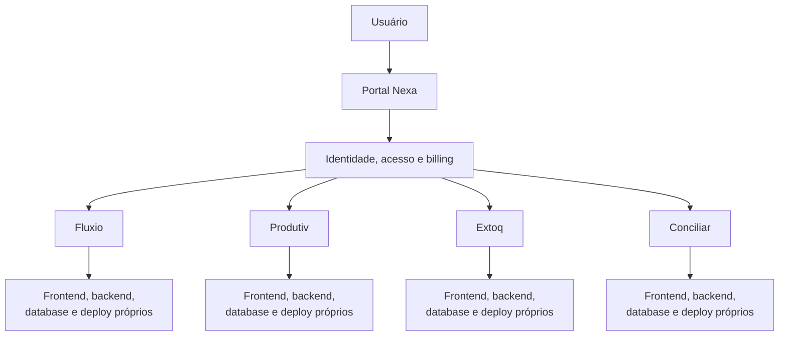

# Arquitetura

## Visão geral

A SWNexa é um ecossistema modular. O Portal Nexa concentra identidade, acesso, contexto de conta e billing; os produtos especializados mantêm a responsabilidade por seus próprios domínios de negócio.

## Independência operacional

Cada produto possui frontend, backend, banco de dados e deploy próprios. Essa estrutura permite que produtos sejam publicados e evoluam em ciclos independentes, sem deixar de participar de uma experiência unificada de identidade e acesso.

## Princípios de design

- O Portal centraliza acesso e descoberta de produtos.
- Produtos preservam responsabilidades de negócio bem delimitadas.
- Aplicações frontend e APIs de backend são separadas.
- Dados são isolados por produto dentro da infraestrutura MongoDB.
- Integrações externas ficam atrás das fronteiras das aplicações.
- A documentação pública omite topologia, endpoints e detalhes específicos de implementação.

## Limite de divulgação

Este é um diagrama conceitual, não um mapa de deploy. Hostnames, endereços de rede, portas, nomes internos e configurações não são publicados.
